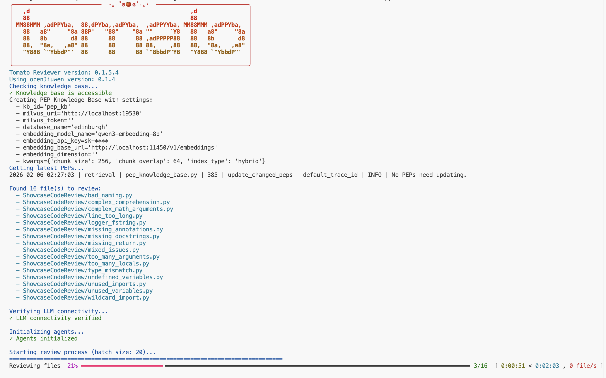

# TomatoReviewer

[English Version](README.md) | [中文版](README.zh.md)

**TomatoReviewer** 是一个智能的 Python 代码检视工具，它结合了静态分析和基于大语言模型（LLM）的推理，提供基于 PEP（Python 增强提案）的全面代码检视以及自动修复功能。


**当前版本：`0.1.5.4 (openJiuwen>=0.1.4)`**

## 概述

TomatoReviewer 使用由大语言模型（LLM）驱动的多智能体架构来检视 Python 代码、识别问题并自动应用修复。与传统的代码检查工具不同，它利用基于 [openJiuwen 知识库框架](https://gitcode.com/openJiuwen/agent-core) 构建的 PEP 知识库，提供符合 Python 最佳实践的专业建议。

本项目旨在作为一个参考实现，展示如何构建一个可自动更新和维护的知识库系统。通过整合 openJiuwen 知识库框架，我们实现了对 Python PEP 文档的自动化索引、检索和应用，为开发者提供了一个完整的知识库应用范例。我们希望这个项目能够起到抛砖引玉的作用，启发更多开发者基于 openJiuwen 知识库框架构建自己的知识库应用，探索知识库在代码检视、文档检索、智能问答等场景中的更多可能性，推动知识库技术在软件开发工具链中的更广泛应用。

## 核心特性

- **基于 LLM 的代码检视**：使用 ReActAgent 框架进行智能代码分析和推理
- **遵循 PEP 规范**：搜索并引用每个问题相关的 PEP 指南
- **自动修复**：基于检视建议迭代应用修复
- **详细报告**：生成包含 PEP 引用的详细 Markdown 报告
- **安全操作**：在修改文件前创建备份
- **代码测试**：通过运行代码验证修复，确保功能保持完整
- **智能配置检测**：自动检测并使用项目特定的 pylint 和 mypy 配置文件，并提供合理的默认配置作为后备

## 技术栈

TomatoReviewer 基于以下技术构建：

- **[openJiuwen](https://gitcode.com/openJiuwen/agent-core)**：智能体框架和知识库系统。PEP 知识库功能利用 openJiuwen 的知识库框架提供向量存储、语义向量模型和混合搜索功能。
- **[pylint](https://pylint.readthedocs.io/en/stable/)**：静态代码分析
- **[ruff](https://docs.astral.sh/ruff/)**：Python代码检查与格式化工具
- **[mypy](https://www.mypy-lang.org)**：静态类型检查

## 工作原理

TomatoReviewer 采用三个专门的智能体：

1. **ReviewerAgent**：使用 pylint 分析代码，搜索 PEP 知识库查找相关指南，并生成包含修复建议的全面检视报告
2. **SearcherAgent**：搜索 PEP 知识库（由 openJiuwen 知识库框架提供支持）以查找相关的编码约定和最佳实践
3. **FixerAgent**：使用 LLM 推理应用修复，结合检视建议和 PEP 上下文，并测试修复以确保代码仍然正常工作

该工具遵循迭代的检视-修复循环：检视文件，应用修复，再次检视，重复此过程直到问题解决或达到最大迭代限制。

PEP 知识库使用 [openJiuwen 知识库框架](https://gitcode.com/openJiuwen/agent-core) 构建，该框架提供向量存储、语义向量模型和混合搜索功能，用于高效检索相关的 PEP 指南。

## 代码仓：
- https://gitcode.com/SushiNinja/TomatoReviewer
- https://github.com/Trenza1ore/TomatoReviewer

## 示例展示

查看使用 Qwen3-8B LLM 生成的 TomatoReviewer 报告和修复的实际示例：

- **示例仓库**：[https://gitcode.com/SushiNinja/showcase-tomato-reviewer/tree/review-0.1.5.1](https://gitcode.com/SushiNinja/showcase-tomato-reviewer/tree/review-0.1.5.1)

示例包括：
- 包含 PEP 引用的详细检视报告
- FixerAgent 自动应用的代码修复
- 各种代码质量问题的示例及其解决方案
- 显示改进效果的修复前后对比

## 安装

使用 `pip`：
```bash
pip install git+https://gitcode.com/SushiNinja/TomatoReviewer.git@main
# 或
pip install git+https://github.com/Trenza1ore/TomatoReviewer.git@main
```

使用 `uv`：
```bash
uv pip install git+https://gitcode.com/SushiNinja/TomatoReviewer.git@main
# 或
uv pip install git+https://github.com/Trenza1ore/TomatoReviewer.git@main
```

## 使用方法

```bash
# 检视当前目录下的所有 Python 文件
tomato-review *.py

# 检视特定文件
tomato-review file1.py file2.py

# 递归检视 src/ 目录下的所有 Python 文件
tomato-review src/**/*.py

# 仅检视不应用修复
tomato-review *.py --no-fix

# 使用自定义最大迭代次数进行检视
tomato-review *.py --max-iter 5

# 使用自定义小批量大小进行检视
tomato-review *.py --mini-batch 10

# 从头构建知识库
tomato-review --build

# 使用自定义配置文件
tomato-review *.py --config-file /path/to/config.yaml
```



### 命令行选项

- `-h, --help`：显示帮助信息并退出
- `-m MAX_ITER, --max-iter MAX_ITER`：文件检视-修复循环的最大迭代次数（默认：5）
- `-s MAX_ITER, --searcher-max-iter MAX_ITER`：搜索智能体的最大迭代次数（默认：5）
- `-f MAX_ITER, --fixer-max-iter MAX_ITER`：修复智能体的最大迭代次数（默认：50）
- `-b MINI_BATCH, --mini-batch MINI_BATCH`：同时处理的文件小批量大小（默认：20）
- `--no-fix`：仅检视文件，不应用修复
- `--build`：从头构建知识库
- `--config-file CONFIG_FILE`：配置文件路径（tomato.yaml、.tomato.yaml 或 pyproject.toml）

## 配置

### TomatoReviewer 配置

在项目根目录创建 `.tomato.yaml`、`tomato.yaml` 或在 `pyproject.toml` 中添加配置。以下是示例配置 - 请根据您的设置调整值：

```yaml
tomato-review:
  kb_id: "edinburgh"
  milvus_uri: "http://your-milvus-host:19530"  # 更新为您的 Milvus 服务器 URI
  milvus_token: ""  # 如果需要，添加您的 Milvus 令牌
  database_name: "pep_kb"
  embedding_model_name: "your-embedding-model"  # 更新为您的语义向量模型名称
  embedding_api_key: "sk-********************"  # 更新为您的 API 密钥
  embedding_base_url: "http://your-embedding-server/v1/embeddings"  # 更新为您的语义向量 API URL
  embedding_dimension: null  # 可选：指定语义向量维度（例如：768、1536）
  chunk_size: 512
  chunk_overlap: 128
  index_type: "hybrid"
  api_base: "http://your-api-server/v1/"  # 更新为您的 LLM API 服务器 URL
  api_key: "sk-********************"  # 更新为您的 LLM API 密钥
  model_name: "your-model-name"  # 更新为您的 LLM 模型名称
  model_provider: "OpenAI"
  verify_ssl: false
  ssl_cert: null
```

### Pylint 和 mypy 配置

TomatoReviewer 会自动检测并按以下顺序使用 pylint 和 mypy 的配置文件：

**Pylint 配置：**
1. 当前工作目录中的 `.pylintrc`、`pylintrc`、`.pylintrc.toml` 或 `pylintrc.toml`
2. 包含 `[tool.pylint]` 部分的 `pyproject.toml`（由 pylint 自动检测）
3. TomatoReviewer 内置的默认 `.pylintrc`（后备方案）

**Mypy 配置：**
1. 当前工作目录中的 `.mypy.ini` 或 `mypy.ini`
2. 包含 `[tool.mypy]` 部分的 `pyproject.toml`（由 mypy 自动检测）
3. TomatoReviewer 内置的默认 `.mypy.ini`（后备方案）

如果未找到项目特定的配置文件，TomatoReviewer 将使用其内置的默认配置，以确保代码分析的一致性。

## 输出

- **检视报告**：`tomato/reviews/` - Markdown 检视报告
- **备份文件**：`tomato/backup/` - 修改前的原始文件
- **日志文件**：`logs/tomato` - 每个文件的处理日志

文件在检视和修复后会就地修改（除非使用 `--no-fix` 选项）。

## 致谢

特别感谢 [openJiuwen](https://gitcode.com/openJiuwen/agent-core) 项目提供知识库框架，为 TomatoReviewer 的 PEP 搜索功能提供支持。
